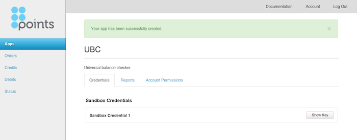

# LCP Getting Started Guide
For Points Loyalty Commerce Platform - Version 1.0

## Document Overview

The purpose of this document is to provide a beginner’s guide to the Points
Loyalty Commerce Platform (LCP). You will find below an introduction to the LCP,
things you need to know before you get started and a step-by-step guide on how
to use the APIs to check member balances. To accomplish this, this document will
introduce you to the `/accounts`, `/apps` and `/lps` resources that are exposed
in the API. The sample code provided uses
[cURL](http://en.wikipedia.org/wiki/CURL) to communicate with the LCP. For a
more detailed description of the LCP and its capabilities see the [LCP Reference
Manual](./?doc=reference-manual) and the [LCP API
Reference](./?doc=api-reference).

## Introducing the Loyalty Commerce Platform API

The LCP's capabilities are exposed to developers through a [RESTful web
API](https://en.wikipedia.org/wiki/Representational_state_transfer#RESTful_web_APIs).
The API consists of a set of resources that can be operated on using standard
HTTP methods. The top-level resources in the LCP are accounts, apps, and lps.

**Accounts** - Your developer account information and credentials are stored
under `/accounts`. Once you create your account you can access it at
`/accounts/<account-id>`

**Apps** - Your apps are stored under the `/apps` endpoint. Each app will be
given a unique ID under `/apps`.

**LPs** - Loyalty programs (LPs) are stored under `/lps`. Each LP will have it’s
own ID under `/lps`.

Some actions can be performed on the collection of resources, while others must
be performed on individual resources. Resources can be created, read, updated,
and deleted using standard HTTP methods.

**POST** - Used to create a resource by sending resource data to the collection.
If successful, returns a `201 (Created)` status code with a Location header that
specifies the location of the newly created resource. All method parameters must
be passed as part of request body using JSON.

**GET** - Used to retrieve a resource from the LCP. This operation is
[idempotent](http://www.w3.org/Protocols/rfc2616/rfc2616-sec9.html#sec9.1.2) and
has no side effects from submitting the same request multiple times. If
successful, returns a `200 (OK)` status code with the resource content.

**PUT** - Used to update an existing resource. This operation is
[idempotent](http://www.w3.org/Protocols/rfc2616/rfc2616-sec9.html#sec9.1.2) and
has no side effects from submitting the same request multiple times. If
successful, returns a `200 (OK)` status code with the resource content. All
method parameters must be passed as part of request body using JSON.

**DELETE** - Used to delete a resource. This operation is
[idempotent](http://www.w3.org/Protocols/rfc2616/rfc2616-sec9.html#sec9.7) and
has no side effects from submitting same request multiple times. If successful,
returns a `204 (No Content)` status code with an empty response body.

**OPTIONS** - Used to determine which of the above operations are permitted for
a given resource. If the resource exists, returns a `200 (OK)` status code with the
list of permitted HTTP methods in the Allow header.

All request and response payloads are [UTF8](http://en.wikipedia.org/wiki/UTF8)
encoded [JSON](http://en.wikipedia.org/wiki/JSON).
[HTTPS](http://en.wikipedia.org/wiki/Https) is used for all requests to ensure
secure communication. When consuming APIs in the LCP, developers must use [OAuth
2.0 Message Authentication Code (MAC) Tokens (draft
02)](http://tools.ietf.org/html/draft-ietf-oauth-v2-http-mac-02) to authenticate
themselves.
[Utilities](https://github.com/Points/Loyalty-Commerce-Platform/tree/master/util)
are available to simplify the request signing process.  See the
[Security](#security) section of this document for more details.

## Things You Should Know About Using the LCP

The Loyalty Commerce Platform (LCP) allows you to write apps that can access
many loyalty programs. The LCP handles the complexity of working with each
loyalty program, creating one simple interface for working with any number of
programs.

### Sandbox vs. Live Mode

The LCP supports two different modes of operation: sandbox mode and live mode.
During development, your application will operate in sandbox mode so that it
doesn’t make changes to any loyalty program member’s account. In sandbox mode,
the LCP never communicates with the loyalty program. All operations are
simulated. When you're ready to deploy your application, Points will promote
your application to live mode.

Sandbox mode is accessed through `https://sandbox.lcp.points.com` while live mode
through `https://lcp.points.com`. Each app has two sets of credentials to access
the LCP: one set for sandbox mode and another set for live mode. When accessing
the LCP in sandbox mode, the sandbox credentials must be used. When your app is
promoted to live mode, Points will provide you with live mode credentials.

### Security

This section describes things you will need to know about LCP security to get
you started with building applications on the LCP.

**All requests to and responses from the LCP are made using HTTPS.** Using HTTPS
has a couple of benefits:

1. HTTPS protects network traffic from eavesdropping by encrypting all traffic
   to and from the LCP so that only the sender and receiver are able to read
   requests and responses.
1. HTTPS permits clients to verify the identity of the server to ensure the
   correct server is receiving its requests.

**All requests include an HTTP Authorization header** to enable the LCP to
validate the sender’s identity. [OAuth 2.0 Message Authentication Code (MAC)
Tokens](http://tools.ietf.org/html/draft-ietf-oauth-v2-http-mac-02)
are used to sign all requests to the LCP after you’ve created your account.
OAuth 2.0 MAC is an evolving variant of OAuth 2.0.

MAC tokens provide enhanced security over OAuth 2.0 Bearer tokens because unlike
Bearer tokens, MAC tokens are never sent between the client and the server. A
bearer token is a shared secret key that is passed from the client to the server
for authentication. However, because bearer tokens involves transmitting the
shared secret key between the client and the server, it can be vulnerable to
attack if a third party gains access to any HTTP request. MAC tokens avoid this
security vulnerability by never transmitting the shared secret key. Instead the
client sends a signature that is generated using the shared secret key and
details about the request. The server also generates the signature using the
same key and request details. If the signatures match then the server knows that
the signatures were generated using the same key and that the message was not
modified during transmission.

The downside of MAC tokens is that the standard is still evolving and has
limited support at this time. This version of the LCP complies with [draft 02 of
the OAuth 2.0 MAC
standard](http://tools.ietf.org/html/draft-ietf-oauth-v2-http-mac-02). When
using this scheme it is highly recommended that you use one of the [LCP Client
Utilities](https://github.com/Points/Loyalty-Commerce-Platform/tree/master/util) to issue
platform requests because these utilities will compute MACs for you.

The credentials required for MAC authentication include a MAC key identifier, a
MAC key and a MAC algorithm. Below is an example of a JSON document representing
the credentials for use with MAC authentication.

    {
      "macKeyIdentifier": "97ee420faaa343d4a04b7378b319b48b",
      "macKey": "NyWslT0Oe7ZNJynyUIwg-SRj3A44DD_lrH6_-dwZ6E4",
      "macAlgorithm": "HMAC-SHA1"
    }

The MAC key identifier uniquely identifies the MAC key. The MAC key identifier
is sent with each request to tell the server which MAC key was used to sign the
request. The MAC key is the shared secret key. It should never be shared with
anyone or transmitted in any request. Keep this key secure as you would any
private key. Finally, the MAC algorithm describes the algorithm used to create
the signature.

The LCP defines 2 different types of credentials:

1. **Account credentials**
  - Account credentials authenticate you to perform actions on your developer account.
  - A set of account credentials is created automatically when you create your developer account.
  - Account credentials are the same for both sandbox and live mode.
  - They are available at `/accounts/<account-id>`.
  - They are used to sign requests to `/accounts` and `/apps`.
1. **Application credentials**
  - Application credentials authenticate your app to perform actions on the LCP.
  - Each app has two sets of application credentials: one for sandbox mode and one for live mode.
  - A set of sandbox credentials is created automatically when you create an app.
  - Live credentials are created by Points when your app is promoted to live mode.
  - Application credentials are available at `/apps/<app-id>`.
  - They are used to sign requests to `/lps`.

If your credentials are compromised, you can create additional credentials and
delete your existing credentials. See the [LCP API
Reference](./?doc=api-reference)
for details.

### HATEOAS

HATEOAS or [Hypermedia as the Engine of Application
State](http://en.wikipedia.org/wiki/HATEOAS) is a characteristic of REST APIs.
In practical terms, it means each response from the LCP contains URLs to other
resources that are relevant to the current resource. This helps makes the API
discoverable and means you don’t need to know how to construct URLs to access
the LCP platform after the first request. In addition, if resource locations are
moved in a later version of the API, your application can automatically follow
the new links without modification. All the information necessary to navigate
the API is in the resource itself.

JSON response documents that are returned by the LCP contain a "links" property.
This property contains URLs that help you consume further resources within the
LCP REST API. For example:

    {
      "links": {
        "self": {
          "href": "https://lcp.points.com/v1/accounts/1234"
        },
        "friendly": {
          "href": "https://lcp.points.com/v1/accounts/email@company.com"
        }
      }
    }

All links sections provided by the LCP contain a "self" link that represents a
URL that can be used to obtain the document again if needed.

Some calls also return a URL called "friendly" which contains a more
user-friendly and readable URL to consume a particular resource.

## Getting Started

Now that you've read through some of the background information and familiarized
yourself with some of the key principles, you're ready to dive in. In this section
you'll find a set of steps needed to start working with the Loyalty Commerce Platform
(LCP). By following these steps, you'll have everything you need to to build a
universal balance checker to retrieve member balances across multiple loyalty
programs. The steps needed are:

1. Create an account
1. Create an app
1. Get your app's sandbox credentials
1. Perform a member validation (MV)

### Create an Account

To create a universal balance checker, your first step is to create an LCP developer
account. A developer account allows you to create one or more applications that
interface with the LCP.

To create your developer account, go to the [LCP
Admin](https://admin.lcp.points.com/) and select "Sign Up". Follow the instructions
to create your account.

### Create an App

Once logged into your account, click on "Apps" in the left-hand navigation to see
your list of apps.

There are no apps so far, so create one by clicking the "Create a new App" button.
Fill in the name and description of your app and click "Create App".

You've now created your first app.

### Get your App's Sandbox Credentials

To access the LCP API, your app needs credentials to authenticate with the LCP. There
are two types of application credentials: sandbox credentials and live credentials.
When developing your application, you will use sandbox credentials to make requests
in sandbox mode. Sandbox mode simulates all transactions with the loyalty programs.
Once you're ready to promote your application to live mode, Points will issue you
live credentials. For now, your app only has sandbox credentials.

Click "Show Key" to view your sandbox credentials. You need to re-enter your password
to confirm your identity.

The MAC key identifier tells the LCP which MAC key you are using. The MAC key is a
shared secret key between you and the platform that you will use to sign requests.
Keep it safe as you would a private cryptographic key. It should never be shared with
anyone or sent directly to the LCP.

### Perform a Member Validation (MV)

Now you're ready to make API requests. A universal balance checker needs to retrieve
the balance in a loyalty program member’s account. This is done by performing a
member validation or MV. An MV authenticates a member of a loyalty program and
retrieves their balance.

Click on "Loyalty Programs" in the left-hand navigation to see the list of loyalty
programs that are supported. You can also get the list of loyalty programs through
the [API](./?doc=api-reference#list-all-lps). Let's start with the Flying Blue program
from Air France KLM. Click on "FlyingBlue". The LP URL provides the base URL for the
loyalty program. Operations against the loyalty program are under this URL. The LP URL is
for live mode. Instead, let's use the LP URL for sandbox mode by changing the server from
"lcp.points.com" to "sandbox.lcp.points.com":

    https://sandbox.lcp.points.com/v1/lps/3b6a77e6-cb40-4b28-a146-341c5862fab6

To perform a member validation for Flying Blue in sandbox mode, POST to:

    https://sandbox.lcp.points.com/v1/lps/3b6a77e6-cb40-4b28-a146-341c5862fab6/mvs/

and provide the member’s credentials in the body of the request as a JSON object. The
member credentials required for an MV vary for each loyalty program. For example, some
loyalty programs may require a member ID and password, while others may require a first
name, last name, and member ID. To determine which fields are required for a particular
loyalty program, you can get its [MV request schema](./?doc=api-reference#mv-request-schema),
which defines the JSON schema for the MV request. Flying Blue requires a member ID and
password. Let’s create an MV using curl:

    curl -v -X POST -H "Content-Type: application/json" \
    -d '{"identifyingFactors": {"memberId": "1234"}, "authenticatingFactors": {"password": "ABCD"}}' \
    "https://sandbox.lcp.points.com/v1/lps/3b6a77e6-cb40-4b28-a146-341c5862fab6/mvs/"

The server returns a 401 status code indicating you are not authorized to POST to the
MV collection:

    HTTP/1.1 401 UNAUTHORIZED
    {
      "errors": [
        {
          "code": "UNAUTHORIZED",
          "description": "The server could not verify that you are authorized to access the URL requested.",
          "field": null
        }
      ]
    }

This error is because we sent an unauthenticated request to the LCP. To authenticate,
you need to include an authorization header in your request. The LCP uses [OAuth 2.0
MAC](http://tools.ietf.org/html/draft-ietf-oauth-v2-http-mac-02) for authentication.
The `lcp_curl.py` Python script provided in [LCP
Utilities](https://github.com/Points/Loyalty-Commerce-Platform/tree/master/util)
makes this easy. For more details building the authorization header for OAuth 2.0
MAC, see [Appendix A: Signing Requests](#appendix-a-signing-requests).

`lcp_curl.py` is a wrapper around curl to add the authorization header. It requires a
-u parameter and your MAC key identifier and MAC key obtained in the previous step.
It passes all other arguments on to curl. It also adds the "Content-Type: application/json"
header so we don’t need to provide that. Let’s try to create an MV again using `lcp_curl.py`:

    lcp_curl.py -v -X POST \
    -u ee83b9af340741e3bec0ad96cb976142:RrvufcCh3Kb3bsqG-wfh8JrQXF8tZG4q3H-_gTACfjM \
    -d '{"identifyingFactors": {"memberId": "1234"}, "authenticatingFactors": {"password": "ABCD"}}' \
    "https://sandbox.lcp.points.com/v1/lps/3b6a77e6-cb40-4b28-a146-341c5862fab6/mvs/"

Behind the scenes, `lcp_curl.py` generates the MAC signature, builds the authorization header, and
includes it in a call to curl like so:

    curl -v -X POST \
    -H 'Authorization: MAC id="ee83b9af340741e3bec0ad96cb976142", ts="1438107842",
    nonce="11SChlLd7+w=", ext="c2e5a99d639f902217f2322d4c4d1374ceda3a71",
    mac="2U8yq4PQ3IXw86zAaxEF3fw4YkI="' \
    -d '{"identifyingFactors": {"memberId": "1234"}, "authenticatingFactors": {"password": "ABCD"}}' \
    "https://sandbox.lcp.points.com/v1/lps/3b6a77e6-cb40-4b28-a146-341c5862fab6/mvs/"

Now the request is authenticated but we get a different error indicating there is no
member with member ID 1234 and password ABCD in the sandbox:

    HTTP/1.1 422 UNPROCESSABLE ENTITY
    {
      "errors": [
        {
          "code": "UNKNOWN_MEMBER",
          "description": "No member could be found with the given credentials."
        }
      ]
    }

If you still received 401 unauthorized, check that your computer's time is accurate
or is synced with an internet time server. `lcp_curl.py` adds a timestamp to each
request and the LCP verifies that the timestamp is within 30 seconds of the server's
time to prevent replay attacks.

To simulate a successful MV in sandbox mode, we need to use one of the pre-configured
sandbox MVs. You can get the list of [sandbox MVs](./?doc=api-reference#sandbox-mvs)
for the loyalty program using the API. For Flying Blue, one of the sandbox MVs has a
member ID to "2202" and a password of "PASSWORD". Let’s do the MV again using these values:

    lcp_curl.py -v -X POST \
    -u ee83b9af340741e3bec0ad96cb976142:RrvufcCh3Kb3bsqG-wfh8JrQXF8tZG4q3H-_gTACfjM \
    -d '{"identifyingFactors": {"memberId": "2202"}, "authenticatingFactors": {"password": "PASSWORD"}}' \
    "https://sandbox.lcp.points.com/v1/lps/3b6a77e6-cb40-4b28-a146-341c5862fab6/mvs/"

This creates a successful MV with a balance of 100,000 miles as specified in the sandbox MV:

    HTTP/1.1 201 CREATED
    {
      "application": "https://lcp.points.com/v1/apps/3ac20648-bce1-4385-9725-83ba3a2161cc",
      "authenticatingFactors": {
        "password": "*****"
      },
      "balance": 100000,
      "createdAt": "2014-04-19T07:56:08.482556Z",
      "identifyingFactors": {
        "memberId": "2202"
      },
      "links": {
        "self": {
          "href": "https://sandbox.lcp.points.com/v1/lps/3b6a77e6-cb40-4b28-a146-341c5862fab6/mvs/09651217-c154-4bcb-853f-cdf379ad7e54"
        }
      },
      "loyaltyProgram": "https://lcp.points.com/v1/lps/3b6a77e6-cb40-4b28-a146-341c5862fab6",
      "status": "success",
      "type": "memberValidation",
      "updatedAt": "2014-04-19T07:56:08.482556Z"
    }

You can retrieve a previous MV by performing a GET on the self link. This
retrieves the MV and balance in the state it was when it was created. To get an
updated member’s balance, create a new MV.

Congratulations, you’ve successfully performed a member validation. This is all
you need to complete your universal balance checker.

To learn more about the capabilities of the LCP, including moving points in and
out of member accounts, refer to the [LCP Reference
Manual](./?doc=reference-manual)
and the [LCP API
Reference](./?doc=api-reference).

## Appendix A: Signing Requests

This appendix contains a step-by-step guide for signing requests with OAuth
2.0 MAC tokens as well as sample code. Follow these steps if you want to write
your own module to sign requests.

1. Generate a timestamp. The timestamp is the number of seconds since January 1,
   1970 00:00:00 UTC. This is also known as POSIX time or Unix time. Requests
   are only valid within 30 seconds of the timestamp.
1. Generate a nonce. A nonce is an arbitrary string that must be different for
   each request in a 30 second window with the same MAC ID.
1. Generate the extension string. The extension string is blank for GET and
   DELETE requests. For PUT and POST requests, concatenate the value of the
   Content-Type header (e.g. "application/json") with the request body and hash
   it with SHA1.
1. Build the normalized request string as follows:
<table>
  <thead>
    <tr>
      <th>Format</th>
      <th>GET Example</th>
      <th>POST Example</th>
    </tr>
  </thead>
  <tbody>
    <tr>
      <td>Timestamp\n Nonce\n HTTP Method (all caps)\n Path\n Hostname\n Port\n Extension\n</td>
      <td>1377721336\n 4FvtoumTybo=\n GET\n /v1/apps/\n lcp.points.com\n 443\n \n</td>
      <td>1377724146\n u8BNUfE5Gu8=\n POST\n /v1/apps/\n lcp.points.com\n 443\n a9d46382c97bd4b0475b5b152dddaf2d61c0a30d\n</td>
    </tr>
  </tbody>
</table>
<ol start="5">
  <li>Decode the MAC key from Base64 if you haven’t already. The MAC key is encoded in Base64 using a URL-safe alphabet. You may need to add padding to the MAC key to decode it.</li>
  <li>Generate the signature by using the HMAC-SHA1 algorithm and the MAC key over the normalized request string.</li>
  <li>Encode the signature in Base64. You do not need to use the URL-safe alphabet.</li>
  <li>Generate the authorization header for the request.</li>
</ol>

#### Example request:

    GET /v1/accounts/342d7d81-c6d0-4968-8518-3525ed71bdb5 HTTP/1.1
    Host: lcp.points.com
    Authorization: MAC id="97ee420faaa343d4a04b7378b319b48b",
                       ts="1379541939",
                       nonce="OK3HY80lkQ0=",
                       ext="",
                       mac="EmYShgBbKjp7XB3gbZq9e0zZy+8="

#### Example C# code:

    using System.Security.Cryptography;

    public string GetAuthorizationHeaderValue(
        string httpMethod,
        Uri url,
        string macKeyIdentifier,
        string macKey,
        string contentType,
        string body)
    {
        // Step 1: Generate timestamp
        TimeSpan t = (DateTime.UtcNow - new DateTime(1970, 1, 1));
        string ts = ((int)t.TotalSeconds).ToString();

        // Step 2: Generate nonce
        string nonce = new Random().Next().ToString();

        // Step 3: Generate ext
        string ext = "";
        if (contentType != null && body != null &&
            contentType.Length > 0 && body.Length > 0)
        {
            string contentTypePlusBody = contentType + body;
            SHA1 sha = new SHA1CryptoServiceProvider();
            ext = BitConverter.ToString(sha.ComputeHash(
                Encoding.ASCII.GetBytes(contentTypePlusBody)));
            ext = ext.Replace("-", "").ToLower();
        }

        // Step 4: Build normalized request string
        string normalizedRequestString =
            string.Format("{0}\n{1}\n{2}\n{3}\n{4}\n{5}\n{6}\n",
                ts,
                nonce,
                httpMethod,
                url.AbsolutePath,
                url.Host,
                url.Port,
                ext);

        // Step 5: Base64 decode the MAC key from URL-safe alphabet
        // and add padding if needed
        macKey = macKey.Replace('-', '+').Replace('_', '/');
        macKey += new string('=', (4 - macKey.Length % 4));
        HashAlgorithm hashGenerator = new HMACSHA1(
            System.Convert.FromBase64String(macKey));

        // Step 6: Generate the signature
        byte[] signature = hashGenerator.ComputeHash(
            Encoding.ASCII.GetBytes(normalizedRequestString));

        // Step 7: Base64 encode the result
        string mac = System.Convert.ToBase64String(signature);

        // Step 8: Build Authorization header
        StringBuilder authorizationHeader = new StringBuilder();
        authorizationHeader.AppendFormat(@"MAC id=""{0}"", ts=""{1}"", nonce=""{2}"", ext=""{3}"", mac=""{4}""", macKeyIdentifier, ts, nonce, ext, mac);

        return authorizationHeader.ToString();
    }

#### Example Python code:

    import urlparse
    import httplib
    import base64
    import hmac
    import hashlib
    import time
    import os

    def generate_authorization_header_value(
            http_method,
            url,
            mac_key_identifier,
            mac_key,
            content_type,
            body):

        url_parts = urlparse.urlparse(url)
        port = url_parts.port
        if not port:
            if url_parts.scheme == 'https':
                port = httplib.HTTPS_PORT
            else:
                port = httplib.HTTP_PORT

        # Step 1: Generate timestamp
        ts = str(int(time.time()))

        # Step 2: Generate nonce
        nonce = base64.b64encode(os.urandom(8))

        # Step 3: Generate ext
        if content_type is not None and body is not None and len(content_type) > 0 and len(body) > 0:
            content_type_plus_body = content_type + body
            content_type_plus_body_hash = hashlib.sha1(content_type_plus_body)
            ext = content_type_plus_body_hash.hexdigest()
        else:
            ext = ""

        # Step 4: Build normalized request string
        normalized_request_string = (
            ts + '\n' +
            nonce + '\n' +
            http_method + '\n' +
            url_parts.path + '\n' +
            url_parts.hostname + '\n' +
            str(port) + '\n' +
            ext + '\n'
        )

        # Step 5: Base64 decode the MAC key from URL-safe alphabet
        # and add padding if needed
        mac_key += '=' * (4 - len(mac_key) % 4)
        mac_key = base64.urlsafe_b64decode(mac_key)

        # Step 6: Generate the signature
        signature = hmac.new(mac_key, normalized_request_string, hashlib.sha1)

        # Step 7: Base64 encode the result
        mac = base64.b64encode(signature.digest())

        # Step 8: Build Authorization header
        return 'MAC id="{0}", ts="{1}", nonce="{2}", ext="{3}", mac="{4}"'.format(mac_key_identifier, ts, nonce, ext, mac)
