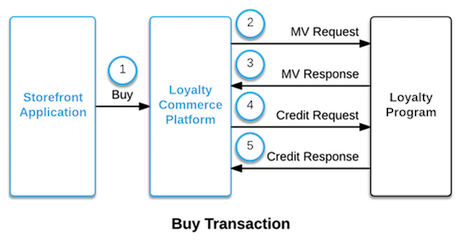
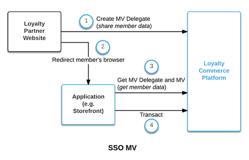

# Loyalty Partner API Reference Manual
For Points Loyalty Commerce Platform - Version 1.0

## Document Overview

This document describes the RESTful API services a Loyalty Partner must implement to enable members using Loyalty Commerce Applications built on the Points Loyalty Commerce Platform (LCP) to transact.

## Introducing the Loyalty Partner API

As a Loyalty Partner (LP), you can integrate with the LCP and all its applications with these simple calls.

1. Member Validation
1. Credit/Debit Posting
1. Transfer Points to/from a member's account
1. Transaction Retry (posting or transfer)
1. Transaction Reversal
1. Single Sign On (SSO)

When an application executes a member validation, credit, or debit operation to you (the Loyalty Partner) via the LCP, the LCP will find the pre-configured URL for your loyalty program's API and that specific operation, and send an HTTP request to that URL.

For example, in a typical Buy transaction, an MV will precede a credit posting in the sequence illustrated.

A reference implementation for the LP API's member validation and credit/debit postings can be found in the [Loyalty Commerce Platform Github repository](https://github.com/Points/Loyalty-Commerce-Platform/tree/master/samples). Our example web server will be "http://api.loyaltyprogram.com" below.

## Validate a Member

The basic API call for all LCP partners is the member validation (MV). Applications on the LCP will submit an MV request to determine if a member exists and check the balance of a loyalty program member's account.

The MV is the only configurable call. As a Loyalty Partner, you define what data fields you receive and share with applications. An MV **request** body will contain a member's details (e.g. account ID, name) and an MV **response** confirms the validity of a member and may include additional member data. Data fields in both the MV request and response are specified in their respective schemas. During the onboarding process, Points configures these schemas on your behalf.

The following parameters are recommended for MV requests:

<table>
  <thead>
    <tr>
      <th>Parameter</th>
      <th>Description</th>
      <th>Required</th>
    </tr>
  </thead>
  <tbody>
    <tr>
      <td>firstName</td>
      <td>First name of the loyalty program member</td>
      <td>Y</td>
    </tr>
    <tr>
      <td>lastName</td>
      <td>Last name of the loyalty program member</td>
      <td>Y</td>
    </tr>
    <tr>
      <td>memberId</td>
      <td>Member ID of the loyalty program member</td>
      <td>Y</td>
    </tr>
  </tbody>
</table>

Sample MV request from applications via the LCP:

    POST http://api.loyaltyprogram.com/MemberValidation
    {
      "firstName": "John",
      "lastName": "Doe",
      "memberId": "A1234567890"
    }

A successful MV response from you will include member details similar to those below if the member exists and is valid for use. You can return additional data to applications on the LCP to enable them to offer personalized loyalty experiences to consumers (e.g. targeted offers).

    200 OK
    {
     "status": "success",
     "memberId": "A1234567890",
     "accountCreationDate": "2015-12-31",
     "countryCode": "CA",
     "cobrand": "XYZ Co"
     "balance": 200000,
     "membershipLevel": "Gold",
     "accountStatus": "Active",
     "email": "test@example.com",
     "eligibility": "TransferToAny"
    }

An MV response for an invalid member must return a **status** and **statusMessage** with a helpful descriptor:

    200 OK
    {
       "status": "failure",
       "statusMessage": "Error: Unknown Member"
    }

## Credit or Debit an Account

As your loyalty members earn or redeem points, this service allows applications on the LCP to post a debit and/or credit to a member’s account.

The following parameters are included in posting requests:

<table>
  <thead>
    <tr>
      <th>Name</th>
      <th>Description</th>
      <th>Required</th>
    </tr>
  </thead>
  <tbody>
    <tr>
      <td>callback</td>
      <td>The callback is a URI passed as a string that uniquely identifies a transaction in the LCP. This is helpful for Points' and your support teams if troubleshooting is required and it is strongly recommended that you store this string.</td>
      <td>Y</td>
    </tr>
    <tr>
      <td>order</td>
      <td>Details of the order that this debit/credit is executed as part of</td>
      <td>N</td>
    </tr>
    <tr>
      <td>bonus</td>
      <td>A boolean value indicating if this is a bonus posting</td>
      <td>N</td>
    </tr>
    <tr>
      <td>amount</td>
      <td>Number of points to be added or removed from the member's account. This number is negative for debits and positive for credits.</td>
      <td>Y</td>
    </tr>
    <tr>
      <td>pic</td>
      <td>Product identification code used for discerning which application and promotion are associated to this transaction. This is helpful for reports</td>
      <td>N</td>
    </tr>
    <tr>
      <td>firstName</td>
      <td>First name of the loyalty program member</td>
      <td>N</td>
    </tr>
    <tr>
      <td>lastName</td>
      <td>Last name of the loyalty program member</td>
      <td>N</td>
    </tr>
    <tr>
      <td>memberId</td>
      <td>Member ID of the loyalty program member. This is identical to the member ID in the MV.</td>
      <td>Y</td>
    </tr>
  </tbody>
</table>

Sample posting request from applications via the LCP:

    POST http://api.loyaltyprogram.com/Posting
    {
       "callback": "https://lcp.points.com/v1/lps/<lp-id>/credits/<id>",
       "amount": 100,
       "bonus": true|false,
       "order" : {
          "orderType": "GIFT",
          "createdAt": "2014-11-25T15:24:00.000000Z",      
          "confirmationNumber": "1111-2222-3333-4444-5555"
       },
       "pic": "POINTSGIFT",
       "memberId": "A1234567890"
    }

A posting response returns the **transactionId** and the **status**. In case of a *failure*, the response must also include a **statusMessage**. The **transactionId** is a string with a maximum length of 100 characters used by the Points support team to troubleshoot and for [transaction retries](./?doc=lp-reference#retry-a-transaction).

    200 OK
    {  
       "status": "success|failure",
       "statusMessage": "Error: Limit exceeded",
       "transactionId": "12345678"
    }

## Transfer Points Between Accounts

As part of your loyalty program features, you may wish to provide a service to allow applications on the LCP to perform one-shot points transfers between loyalty member accounts. This API call withdraws/debits points from one account and deposits/credits them to another in a single transaction.

The following parameters are included in transfer requests:

<table>
  <thead>
    <tr>
      <th>Name</th>
      <th>Description</th>
      <th>Required</th>
    </tr>
  </thead>
  <tbody>
    <tr>
      <td>callback</td>
      <td>The callback is a URI passed as a string that uniquely identifies a transaction in the LCP. This is helpful for Points' and your support teams if troubleshooting is required and it is strongly recommended that you store this string.</td>
      <td>Y</td>
    </tr>
    <tr>
      <td>order</td>
      <td>Details of the order that this debit/credit is executed as part of.</td>
      <td>N</td>
    </tr>
    <tr>
      <td>amount</td>
      <td>Number of points to be removed from the member's account and added to the recipient's. This number is negative (for debits).</td>
      <td>Y</td>
    </tr>
    <tr>
      <td>pic</td>
      <td>Product identification code used for discerning which application and promotion are associated to this transaction. This is helpful for reports</td>
      <td>N</td>
    </tr>
    <tr>
      <td>member/firstName</td>
      <td>First name of the loyalty program member transacting</td>
      <td>N</td>
    </tr>
    <tr>
      <td>member/lastName</td>
      <td>Last name of the loyalty program member transacting</td>
      <td>N</td>
    </tr>
    <tr>
      <td>member/memberId</td>
      <td>Member ID of the loyalty program member transacting. This is identical to the member ID in the MV.</td>
      <td>Y</td>
    </tr>
    <tr>
      <td>recipient/firstName</td>
      <td>First name of the loyalty program member receiving the points</td>
      <td>N</td>
    </tr>
    <tr>
      <td>recipient/lastName</td>
      <td>Last name of the loyalty program member receiving the points</td>
      <td>N</td>
    </tr>
    <tr>
      <td>recipient/memberId</td>
      <td>Member ID of the loyalty program member receiving the points</td>
      <td>Y</td>
    </tr>
  </tbody>
</table>

Sample point transfer request from applications via the LCP:

    POST http://api.loyaltyprogram.com/Transfer
    {
       "callback": "https://lcp.points.com/v1/lps/<lp-id>/credits/<id>",
       "amount": 100,
       "order" : {
          "orderType": "TRANSFER",
          "createdAt": "2015-11-25T15:24:00.000000Z",
          "confirmationNumber": "1111-2222-3333-4444-5555"
       },
       "pic": "TRANSFER",
       "member": {
          "memberId": "A1234567890"
       },
       "recipient": {
          "memberId": "B1234567890"
       }
    }

A point transfer response returns the **transactionId** and the **status**. In case of a *failure*, the response must include a **statusMessage**.

    200 OK
    {  
       "status": "success|failure",
       "statusMessage": "Error: Insufficient balance",
       "transactionId": "12345678"
    }

## Retry a Transaction

Occasionally, your system may undergo maintenance or experience downtime. During this time, you can return a status of "*systemError*" instead of "*failure*" to the LCP for any transactions (credit/debit posting, transfer) received. "*systemError*" informs the application on the LCP that the request passed may be correct For these transactions, your API should accept a call with the **transactionId**. The Points support team can then retry the transaction at a later time by sending the same **transactionId** used on the original request.

The following parameter is included in retry requests:

<table>
  <thead>
    <tr>
      <th>Name</th>
      <th>Description</th>
      <th>Required</th>
    </tr>
  </thead>
  <tbody>
    <tr>
      <td>transactionId</td>
      <td>ID of the transaction being reattempted. This should be used to ensure that the initial transaction was indeed not successful.</td>
      <td>Y</td>
    </tr>
  </tbody>
</table>

Sample retry request from the LCP:

    POST http://api.loyaltyprogram.com/RetryTransaction
    {
       "transactionId": "12345678"
    }

A transaction retry response returns the **transactionId** and the **status**. In case of a *failure*, the response must include a **statusMessage**.

    200 OK
    {  
       "status": "success|failure",
       "statusMessage": "Error: Transaction already succeeded",
       "transactionId": "12345678"
    }

## Transaction Reversals

Transactions (postings or transfers) may be cancelled for any number of reasons and members' balances should be updated in a timely manner. You may wish to provide a service to handle reversals automatically.

A transaction can be fully or partially reversed by sending the same **transactionId** used on the original request. The amount of points to reverse will always be specified and the sign (+/-) will indicate the operation to the member's points account. Amounts greater than 0 should add points into a member's account, while a negative amount should remove points.

Each reversal will be made on a successful transaction. If the cumulative amount to be reversed is more than the points originally transacted, the reversal should be rejected.

The following parameters are included in reversal requests:

<table>
  <thead>
    <tr>
      <th>Name</th>
      <th>Description</th>
      <th>Required</th>
    </tr>
  </thead>
  <tbody>
    <tr>
      <td>transactionId</td>
      <td>ID of the transaction being reversed. This should be used to ensure that the initial transaction was indeed successful.</td>
      <td>Y</td>
    </tr>
    <tr>
      <td>amount</td>
      <td>Number of points to reverse for the transaction. This field will be populated for all reversals.</td>
      <td>Y</td>
    </tr>
  </tbody>
</table>

Sample reversal request from the LCP to remove 2000 points from the member account corresponding to the transactionId:

    POST http://api.loyaltyprogram.com/Reversal
    {
       "transactionId": "12345678",
       "amount": -2000
    }

A reversal response returns the **transactionId** and the **status**. In case of a *failure*, the response must include a **statusMessage**.

    200 OK
    {  
       "status": "success",
       "transactionId": "12345678"
    }

    400 BAD REQUEST
    {  
       "status": "failure",
       "statusMessage": "Error: No such transactionId",
       "transactionId": "12345678"
    }

## Call Authorization

We recommend using Basic Auth (an encrypted username/password pair) to authorize calls from the LCP.

## Single Sign On (SSO)

Your loyalty members only sign in once on your loyalty program site and can continue logged in to applications on the LCP. With SSO, LCP applications do not need member credentials (i.e. password) for members to browse and transact.

When the member is signed in and visits a link on your loyalty program’s website to an LCP application, your loyalty program can provide the member’s info to the LCP and allow the LCP application to retrieve it without sharing any confidential information about the member through the web browser.

SSO is a five-step process:

1. **Your loyalty program [creates an MV delegate](https://points.github.io/Loyalty-Commerce-Platform/?doc=api-reference#create-a-mv-delegate) on the LCP.** Your loyalty program provides the member info needed to create an MV and "delegates" the MV to the application so that the application has permission to access the MV. The LCP creates the MV and returns the MV URL to your loyalty program.
1. **Your loyalty program redirects the user to the application and provides the application with the MV delegate URL.** No member information is passed in the redirect. It is securely stored in the LCP.
1. **The application [gets the MV delegate](https://points.github.io/Loyalty-Commerce-Platform/?doc=api-reference#get-a-mv-delegate) from the LCP using the MV delegate URL** to securely obtain the location of the MV.
1. **The application [gets the MV](https://points.github.io/Loyalty-Commerce-Platform/?doc=api-reference#get-a-mv) from the LCP using the MV URL** in the MV delegate to securely obtain information about the member and perform transactions. Authenticating factors like the member’s password are not shared with the application.
1. If necessary, the application gets the member details from the LCP by appending "/member-details" to the MV URL to securely obtain additional information about the member.

A [reference implementation of the SSO API](https://github.com/Points/Loyalty-Commerce-Platform/tree/master/samples/java/sso-reference-implementation) can be found in the LCP Github repository.
