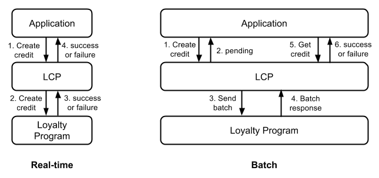

# LCP Reference Manual
For Points Loyalty Commerce Platform - Version 1.0

## Document Overview

This document contains an in-depth description of the Points Loyalty Commerce
Platform (LCP). You will find below descriptions of the platform,
authentication, and error codes. This document assumes have read the [LCP Getting
Started Guide for Developers](./). For a detailed description of the API, see the [LCP
API Reference](./?doc=api-reference).

## Sandbox vs Live

The LCP operates in two modes: sandbox mode and live mode. Sandbox mode is
accessed at `https://sandbox.lcp.points.com` while live mode is accessed at
`https://lcp.points.com`. Each has a separate set of credentials for
authentication. When you create an application, you will get a set of sandbox
credentials for use in the sandbox environment. Live mode credentials are issued
by Points when you’re ready to deploy your application.

Use sandbox mode during development and to test your application. In the
Sandbox, you can test your application against one or more loyalty programs
without affecting live member accounts of the loyalty programs. Sandbox mode
never affects member accounts; all operations are simulated. The API reference
describes how to simulate different success and failure conditions in sandbox
mode that your app will experience in live mode.

To go live, you’ll need to request live credentials from Points. Once your
receive them, you’ll need to update your application to use the live credentials
and the live endpoint located at `https://lcp.points.com`. Only Live credentials
have permission to access this endpoint. Once in the live environment, we
recommend you run additional tests using live test accounts for each of the
loyalty programs your app interacts.

## Versioning

The LCP uses version numbering in the URI. To access the version of the API
described in this document use `https://sandbox.lcp.points.com/v1/` or
`https://lcp.points.com/v1/`. New versions will be created for backwards
incompatible changes to the API. We will notify you of new versions of the API
and give you time to transition to the new version before discontinuing support
for the old version.

## Multiple Data Centers

The LCP is a high availability service operating in multiple data centers
globally. The platform is designed to maximize availability and scalability but
understanding how the LCP works will ensure your Application knows what to
expect.

Requests to the LCP are routed to the closest data center. Unless that data
center fails or you change geographies (significantly) your requests will
continue to be routed to the same data center. Requests that change data in one
data center are replicated to the other data centers. Replication happens
quickly and in the background so as not to delay processing of your requests.
Since your requests typically hit the same data center, replication is generally
invisible to your application. This characteristic of the LCP is called eventual
consistency. For more background information on this topic please reference
[Eventually Consistent -
Revisited](http://www.allthingsdistributed.com/2008/12/eventually_consistent.html).

In the unlikely event of a data center failing, the LCP will automatically
failover to a secondary data center. This may result in recently created
resources not being immediately available in the data center to which you fail
over until replication has completed. To get started don't worry about this
failure scenario. However, keep in mind that you in rare instances, you may need
to wait and resend your request to access recently created or modified data.

## Authorization

The LCP uses OAuth 2.0 Message Authentication Code (MAC) Tokens to authenticate
requests to the platform. This version of the LCP API matches [draft 02 of the
OAuth 2.0 MAC Token
specification](http://tools.ietf.org/html/draft-ietf-oauth-v2-http-mac-02). We
have provided a set of [LCP Client
Utilities](https://github.com/Points/Loyalty-Commerce-Platform/tree/master/util)
to help you get started with OAuth 2.0 MAC authentication.

### Types of Credentials

There are three types of MAC credentials used in the LCP:

1. [Account credentials](./?doc=api-reference#account-credentials) are
   used to authenticate you when accessing `/accounts` and
   `/apps` resources. Account credentials are created automatically when you
   create an account.
1. [Sandbox credentials](./?doc=api-reference#sandbox-credentials) are
   used by your app to authenticate its requests to the `/lps` resource in the
   sandbox environment. Sandbox credentials are created automatically when you
   create an app.
1. [Live credentials](./?doc=api-reference#live-credentials) are used by
   your app to authenticate its requests to the `/lps` resource in the live
   environment. Live credentials are managed by Points.

Each set of credentials include a MAC key identifier, a MAC key and a MAC
algorithm. The MAC key identifier uniquely identifies the MAC key. The MAC key
identifier is sent with each request to tell the server which MAC key was used
to sign the request. The MAC key is the shared secret key. It should never be
shared with anyone or transmitted in any request. Keep this key secure as you
would any private key. Finally, the MAC algorithm describes the algorithm used
to create the signature. It is always set to `HMAC-SHA1`.

    {
      "macKeyIdentifier": "97ee420faaa343d4a04b7378b319b48b",
      "macKey": "NyWslT0Oe7ZNJynyUIwg-SRj3A44DD_lrH6_-dwZ6E4",
      "macAlgorithm": "HMAC-SHA1"
    }

NOTE: The MAC key is [Base64](http://tools.ietf.org/html/rfc4648) encoded using
a URL-safe alphabet, which substitutes `-` instead of `+` and `_` instead of `/`
in the standard Base64 alphabet. TheMAC key also may not contain padding
(represented with the `=` character). Prior to using the MAC key, decode it from
Base64.

### The Authorization Header

Except when creating an account, all requests to the platform must include an
authorization header. The authorization header includes the authorization type
“MAC” and the following five fields:

<table>
  <thead>
    <tr>
      <th>Field</th>
      <th>Description</th>
    </tr>
  </thead>
  <tbody>
    <tr>
      <td>id</td>
      <td>The MAC key identifier that uniquely identifies the MAC key used to generated the MAC signature.</td>
    </tr>
    <tr>
      <td>ts</td>
      <td>An integer timestamp equal to the number of seconds since January 1, 1970 00:00:00 UTC. This is also known as POSIX time or Unix time. Requests are only valid within 30 seconds of the timestamp.</td>
    </tr>
    <tr>
      <td>nonce</td>
      <td>An arbitrary string that must be different for each request in a 30 second window with the same MAC key identifier. Used to prevent replay attacks.</td>
    </tr>
    <tr>
      <td>ext</td>
      <td>The extension string is used to verify the contents of the request. It is an empty string for GET and DELETE request. For PUT and POST requests, concatenate the value of the Content-Type header (e.g. “application/json”) with the request body and hash it with SHA1.</td>
    </tr>
    <tr>
      <td>mac</td>
      <td>The MAC signature for this request. The MAC signature is a Base64 encoded string that is generated by the HMAC-SHA1 algorithm, the MAC key, and the normalized request string. This process is described in the next section.</td>
    </tr>
  </tbody>
</table>

Note that the MAC key is not included in the authorization header. This key is a
secret and should not be included in any request. Here is an example of an
authorization header:

    Authorization: MAC id="97ee420faaa343d4a04b7378b319b48b",
                       ts="1379541939",
                       nonce="OK3HY80lkQ0=",
                       ext="",
                       mac="EmYShgBbKjp7XB3gbZq9e0zZy+8="

When this authorization header is provided in requests to protected resources,
the LCP authenticates the request using the following steps:

1. Checks that the timestamp is within 30 seconds of the current time.
1. Checks that the nonce has not been used in a previous request with the same
   MAC key identifier in the 30 second window.
1. Checks the MAC signature by using the same process as the client. Using the
   MAC key that corresponds to the MAC key identifier and the request details,
   the LCP generates a MAC signature for this request and compares it to the one
   that was passed in the authorization header.
1. Generates the extension string and verifies that it matches the string provided in the authorization header.

If all of these conditions are met the request is authenticated.

### Generating the MAC Signature

The MAC signature is generated using the MAC key and a normalized request string
that contains the details of the request. The normalized request string is
assembled as follows (`\n` indicates a new line character at the end of every
line):

<table>
  <thead>
    <tr>
      <th>Format</th>
      <th>GET Example</th>
      <th>POST Example</th>
    </tr>
  </thead>
  <tbody>
    <tr>
      <td>
        Timestamp\n 
        Nonce\n 
        HTTP Method (all caps)\n 
        Path\n 
        Hostname\n 
        Port\n 
        Extension\n 
      </td>
      <td>
        1377721336\n 
        4FvtoumTybo=\n 
        GET\n 
        /v1/apps/\n 
        lcp.points.com\n 
        443\n 
        \n 
      </td>
      <td>
        1377724146\n 
        u8BNUfE5Gu8=\n 
        POST\n 
        /v1/apps/\n 
        lcp.points.com\n 
        443\n 
        a9d46382c97bd4b0475b5b152dddaf2d61c0a30d\n 
      </td>
    </tr>
  </tbody>
</table>

- **Timestamp:** The number of seconds since January 1, 1970 00:00:00 UTC. This
  is also known as POSIX time or Unix time. Requests are only valid within 30
  seconds of the timestamp.
- **Nonce:** An arbitrary string that must be different for each request in a 30
  second window with the same MAC ID.
- **HTTP Method:** One of GET, PUT, POST, or DELETE (must be uppercase).
- **Path:** The path to the resource on the server. Starts with the slash after
  the hostname/port in the URI.
- **Hostname:** The hostname of the server in the HTTP request. Do not include
  the protocol (`https://`), port or path.
- **Port:** The port for the HTTP request. Use 443 for HTTPS.
- **Extension:** Blank for GET and DELETE request. For PUT and POST requests,
  concatenate the value of the Content-Type header (e.g. `application/json`)
  with the request body and hash it with SHA1.

This normalized request string and the MAC key are fed into the HMAC-SHA1
algorithm to obtained the binary MAC signature. The binary signature is
[Base64](http://tools.ietf.org/html/rfc4648) encoded for inclusion in the
[authorization header](#the-authorization-header) for the request.

Here is an example of using the HMAC-SHA1 algorithm to generate the signature in Python:

    def generate_signature(mac_key, normalized_request_string):
        """Generate a request's MAC given a normalized request string (aka
        a summary of the key elements of the request and the mac key (shared
        secret)."""

        import hmac
        import hashlib
        import base64

        # Add padding to the MAC key if needed
        mac_key+= '=' * (4 - len(mac_key) % 4)

        # Base64 decode the MAC key using URL-safe alphabet
        mac_key= base64.urlsafe_b64decode(mac_key)

        # Create the hash
        hashed = hmac.new(mac_key, normalized_request_string, hashlib.sha1)

        # Base64 encode the result
        return base64.b64encode(hashed.digest())

## Correlation ID

Every request sent to the LCP is assigned a correlation ID. This value is returned
in the API response in the `PTS-LCP-CID` header. When inquiring about a request, send
this value to Points to help us find your request as quickly as possible.

## Single Sign-On (SSO)

There are two ways to validate loyalty program member credentials and obtain account
balances: direct MV and SSO MV.

### Direct MV

Applications perform a member validation against a loyalty program. Applications
[create an MV](./?doc=api-reference#create-a-mv) and provide the member’s
credentials. The LCP verifies these credentials with the loyalty program and returns
the member’s account balance to the application. This is the simplest solution for
both applications and loyalty programs, but requires the application to collect
member credentials.

### SSO MV

Single sign-on doesn’t require any application built on top of the Loyalty Commerce Platform to collect member credentials and
avoids requiring the member to login with both the loyalty program website and the
application. If the member is already signed in on the loyalty program’s website and
the loyalty program’s website links to the application, the loyalty program can
provide the member’s info to the LCP and allow the application to retrieve it without
sharing any confidential information about the member through the web browser. SSO is
a five step process:

1. The Loyalty Program [creates an MV delegate](./?doc=api-reference#create-a-mv-delegate)
   on the LCP. The loyalty program provides the member info needed to create an MV and
   "delegates" the MV to the application so that the application has permission to access
   the MV. The LCP creates the MV and returns the MV URL to the loyalty program.
1. The loyalty program redirects the user to the application and provides the
   application with the MV delegate URL. No member information is passed in the redirect. It
   is securely stored in the LCP.
1. The application [gets the MV delegate](./?doc=api-reference#get-a-mv-delegate) from the LCP using the MV delegate
   URL to securely obtain the location of the MV.
1. The application [gets the MV](./?doc=api-reference#get-a-mv) from the LCP using the MV
   URL in the MV delegate to securely obtain information about the member and perform transactions.
   Authenticating factors like the member’s password are not shared with the application.
1. If necessary, the application gets the member details from the LCP by appending "/member-details"
   to the MV URL to securly obtain additional information about the member.

To see a reference implementation of this, please proceed to the [LCP Samples](https://github.com/Points/Loyalty-Commerce-Platform/tree/master/samples/java/sso-reference-implementation).

## Real-time vs Batch

Moving points in or out of loyalty accounts can happen either in real-time or in a
periodic batch process. The process used depends on the loyalty program. Applications
should be built to handle both cases so they can work with any loyalty program. Even
when using a single loyalty program, applications should test both processes in
sandbox mode in case the loyalty program changes their process in the future.

### Real-time

Most loyalty programs process debits and credits in real-time. When applications
create debits or credits, the LCP forwards the request to the loyalty program and the
loyalty program processes the request immediately. The LCP tells the application
whether the debit or credit succeeded.

### Batch

A few loyalty programs process debits and/or credits in a batch process. When the LCP
receives a request, it returns a status of pending and queues the request.
Periodically, the LCP sends the queued requests to the loyalty program for processing
(this happens once a day for most LPs). Some time later (typically within 24 hours),
the LP returns the result of all the debits and credits in the batch. The application
should periodically poll pending debits or credits to determine their result.

## Using Orders

All transactions must be part of an order for them to appear in the order search
support tool and the transaction reports in the [LCP
Admin](https://admin.lcp.points.com/) console. An order is a composite transaction
that associates multiple primitive transactions together. Primitive transactions
include MVs, debits, and credits. The order contains details about the composite
transaction and its fulfillment history. Additional metadata about the order can also
be included in the data section.

There are six steps for using orders:

1. Create an MV
1. Create an order
1. Add the MV to the order
1. Create the debit or credit
1. Update the status of the order
1. Search for updated orders

### Create an MV

The first step is to [create a member validation
(MV)](./?doc=api-reference#create-a-mv) to validate the member's credentials. Let's
create a sandbox MV for Flying Blue like we did in the [LCP Getting Started
Guide](./#perform-a-member-validation-mv-). Use your application's sandbox
credentials to sign the request.

    POST https://sandbox.lcp.points.com/v1/lps/3b6a77e6-cb40-4b28-a146-341c5862fab6/mvs/
    Authorization: MAC id="...", ts="...", nonce="...", ext="...", mac="..."
    {
      "identifyingFactors": {
        "memberId": "2202"
      },
      "authenticatingFactors": {
        "password": "PASSWORD"
      }
    }

If the member credentials are correct, you'll receive the member's balance:

    201 CREATED
    location: https://sandbox.lcp.points.com/v1/lps/3b6a77e6-cb40-4b28-a146-341c5862fab6/mvs/09651217-c154-4bcb-853f-cdf379ad7e54
    {
      "application": "https://sandbox.lcp.points.com/v1/apps/3ac20648-bce1-4385-9725-83ba3a2161cc",
      "authenticatingFactors": {
        "password": "*****"
      },
      "balance": 100000,
      "createdAt": "2014-02-26T17:46:00.000000Z",
      "identifyingFactors": {
        "memberId": "2202"
      },
      "links": {
        "self": {
          "href": "https://sandbox.lcp.points.com/v1/lps/3b6a77e6-cb40-4b28-a146-341c5862fab6/mvs/09651217-c154-4bcb-853f-cdf379ad7e54"
        }
      },
      "loyaltyProgram": "https://sandbox.lcp.points.com/v1/lps/3b6a77e6-cb40-4b28-a146-341c5862fab6",
      "status": "success",
      "type": "memberValidation",
      "updatedAt": "2014-02-26T17:46:00.000000Z"
    }

### Create an Order

After the user has successfully validated their credentials, you can [create an
order](./?doc=api-reference#create-an-order) for them. The order type can be either
EXCHANGE_CREDIT for credit orders or REDEEM_DEBIT for debit orders. Contact Points to
determine which order type you should use.

    POST https://sandbox.lcp.points.com/v1/orders/
    Authorization: MAC id="...", ts="...", nonce="...", ext="...", mac="..."
    {
      "data": {
        "clientIpAddress": "127.0.0.1",
        "clientUserAgent": "Mozilla/5.0 (X11; Ubuntu; Linux x86_64; rv:42.0) Gecko/20100101 Firefox/42.0",
        "language": "en-US",
        "orderDetails": {
          "basePoints": 2000,
          "loyaltyProgram": "https://sandbox.lcp.points.com/v1/lps/3b6a77e6-cb40-4b28-a146-341c5862fab6"
        },
        "user": {
          "email": "jdoe@example.com",
          "firstName": "John",
          "lastName": "Doe",
          "memberId": "2202",
          "memberValidation": "https://sandbox.lcp.points.com/v1/lps/3b6a77e6-cb40-4b28-a146-341c5862fab6/mvs/09651217-c154-4bcb-853f-cdf379ad7e54"
        }
      },
      "orderType": "EXCHANGE_CREDIT"
    }

The order is created with the order details. The order confirmation number can be
provided to the user in case they need to inquire about their order later. The order
status is set to "initial".

    201 CREATED
    location: https://sandbox.lcp.points.com/v1/orders/12f5a924-1126-4e0c-900a-0a103f4146c0
    {
      "application": "https://sandbox.lcp.points.com/v1/apps/3ac20648-bce1-4385-9725-83ba3a2161cc",
      "confirmationNumber": "3902-2266-8404-8538-1721",
      "createdAt": "2014-02-26T17:47:00.000000Z",
      "data": {
        "clientIpAddress": "127.0.0.1",
        "clientUserAgent": "Mozilla/5.0 (X11; Ubuntu; Linux x86_64; rv:42.0) Gecko/20100101 Firefox/42.0",
        "language": "en-US",
        "orderDetails": {
          "basePoints": 2000,
          "loyaltyProgram": "https://sandbox.lcp.points.com/v1/lps/3b6a77e6-cb40-4b28-a146-341c5862fab6"
        },
        "user": {
          "email": "jdoe@example.com",
          "firstName": "John",
          "lastName": "Doe",
          "memberId": "2202",
          "memberValidation": "https://sandbox.lcp.points.com/v1/lps/3b6a77e6-cb40-4b28-a146-341c5862fab6/mvs/09651217-c154-4bcb-853f-cdf379ad7e54"
        }
      },
      "links": {
        "self": {
          "href": "https://sandbox.lcp.points.com/v1/orders/12f5a924-1126-4e0c-900a-0a103f4146c0"
        }
      },
      "orderType": "EXCHANGE_CREDIT",
      "status": "initial",
      "type": "order",
      "updatedAt": "2014-02-26T17:47:00.000000Z",
      "updates": []
    }

### Add the MV to the Order

The MV you created in the first step needs to be associated with the new order you just
created. To do that, [PATCH the MV](./?doc=api-reference#update-a-mv) with a link to
the order:

    PATCH https://sandbox.lcp.points.com/v1/lps/3b6a77e6-cb40-4b28-a146-341c5862fab6/mvs/09651217-c154-4bcb-853f-cdf379ad7e54
    Authorization: MAC id="...", ts="...", nonce="...", ext="...", mac="..."
    {
      "order": "https://sandbox.lcp.points.com/v1/orders/12f5a924-1126-4e0c-900a-0a103f4146c0"
    }

The updated MV is returned in the response:

    200 OK
    {
      "application": "https://sandbox.lcp.points.com/v1/apps/3ac20648-bce1-4385-9725-83ba3a2161cc",
      "authenticatingFactors": {
        "password": "*****"
      },
      "balance": 100000,
      "createdAt": "2014-02-26T17:46:00.000000Z",
      "identifyingFactors": {
        "memberId": "2202"
      },
      "links": {
        "self": {
          "href": "https://sandbox.lcp.points.com/v1/lps/3b6a77e6-cb40-4b28-a146-341c5862fab6/mvs/09651217-c154-4bcb-853f-cdf379ad7e54"
        }
      },
      "loyaltyProgram": "https://sandbox.lcp.points.com/v1/lps/3b6a77e6-cb40-4b28-a146-341c5862fab6",
      "order": "https://sandbox.lcp.points.com/v1/orders/12f5a924-1126-4e0c-900a-0a103f4146c0",
      "status": "success",
      "type": "memberValidation",
      "updatedAt": "2014-02-26T17:47:30.000000Z"
    }

### Create the Debit or Credit

Now you can add (credit) or remove (debit) points from the member's account. In this
example, we'll [create a credit](./?doc=api-reference#create-a-credit) to add 2000
points to the member's account:

    POST https://sandbox.lcp.points.com/v1/lps/3b6a77e6-cb40-4b28-a146-341c5862fab6/credits/
    Authorization: MAC id="...", ts="...", nonce="...", ext="...", mac="..."
    {
      "amount": 2000,
      "memberValidation": "https://sandbox.lcp.points.com/v1/lps/3b6a77e6-cb40-4b28-a146-341c5862fab6/mvs/09651217-c154-4bcb-853f-cdf379ad7e54"
    }

The credit is automatically added to the same order as the MV. The credit status can
be success, failure, systemError or pending. Failure means that the LP rejected the
request. A system error means there was a problem communicating with the LP. Points
will investigate system errors to determine if the transaction went through. Pending
means the credit will be sent in a nightly batch file to the LP and it will be
updated later with the result. This credit came back successful:

    201 CREATED
    location: https://sandbox.lcp.points.com/v1/lps/3b6a77e6-cb40-4b28-a146-341c5862fab6/credits/d38a9ecf-0863-4a7f-81d6-0efaf15a4425
    {
      "amount": 2000,
      "application": "https://sandbox.lcp.points.com/v1/apps/3ac20648-bce1-4385-9725-83ba3a2161cc",
      "createdAt": "2014-02-26T17:49:00.000000Z",
      "links": {
        "self": {
          "href": "https://sandbox.lcp.points.com/v1/lps/3b6a77e6-cb40-4b28-a146-341c5862fab6/credits/d38a9ecf-0863-4a7f-81d6-0efaf15a4425"
        }
      },
      "loyaltyProgram": "https://sandbox.lcp.points.com/v1/lps/3b6a77e6-cb40-4b28-a146-341c5862fab6",
      "memberValidation": "https://sandbox.lcp.points.com/v1/lps/3b6a77e6-cb40-4b28-a146-341c5862fab6/mvs/09651217-c154-4bcb-853f-cdf379ad7e54",
      "order": "https://sandbox.lcp.points.com/v1/orders/12f5a924-1126-4e0c-900a-0a103f4146c0",
      "status": "success",
      "transactionId": "15786560",
      "type": "credit",
      "updatedAt": "2014-02-26T17:49:00.000000Z"
    }

### Update the Status of the Order

The next step is to [update the order](./?doc=api-reference#update-an-order) with its
status. Update the order status based on the status of the debit or credit:

<table>
  <thead>
    <tr>
      <th>Debit/Credit Status</th>
      <th>Order Status</th>
    </tr>
  </thead>
  <tbody>
    <tr>
      <td>success</td>
      <td>complete</td>
    </tr>
    <tr>
      <td>failure</td>
      <td>debitFailed/creditFailed</td>
    </tr>
    <tr>
      <td>systemError</td>
      <td>debitError/creditError</td>
    </tr>
    <tr>
      <td>pending</td>
      <td>debitPending/creditPending</td>
    </tr>
  </tbody>
</table>

In this case, the credit status is "success" so let’s update the order status to
"complete":

    PATCH https://sandbox.lcp.points.com/v1/orders/12f5a924-1126-4e0c-900a-0a103f4146c0
    Authorization: MAC id="...", ts="...", nonce="...", ext="...", mac="..."
    {
      "status": "complete"
    }

The order with the updated status is returned. Note that the "updates" section of the
order includes the order fulfillment history including the MV and the credit.

    200 OK
    {
      "application": "https://sandbox.lcp.points.com/v1/apps/3ac20648-bce1-4385-9725-83ba3a2161cc",
      "confirmationNumber": "3902-2266-8404-8538-1721",
      "createdAt": "2014-02-26T17:47:00.000000Z",
      "data": {
        "clientIpAddress": "127.0.0.1",
        "clientUserAgent": "Mozilla/5.0 (X11; Ubuntu; Linux x86_64; rv:42.0) Gecko/20100101 Firefox/42.0",
        "language": "en-US",
        "orderDetails": {
          "basePoints": 2000,
          "loyaltyProgram": "https://sandbox.lcp.points.com/v1/lps/3b6a77e6-cb40-4b28-a146-341c5862fab6"
        },
        "user": {
          "email": "jdoe@example.com",
          "firstName": "John",
          "lastName": "Doe",
          "memberId": "2202",
          "memberValidation": "https://sandbox.lcp.points.com/v1/lps/3b6a77e6-cb40-4b28-a146-341c5862fab6/mvs/09651217-c154-4bcb-853f-cdf379ad7e54"
        }
      },
      "links": {
        "self": {
          "href": "https://sandbox.lcp.points.com/v1/orders/12f5a924-1126-4e0c-900a-0a103f4146c0"
        }
      },
      "orderType": "EXCHANGE_CREDIT",
      "status": "complete",
      "type": "order",
      "updatedAt": "2014-02-26T17:50:00.000000Z",
      "updates": [
        {
          "resource": "https://sandbox.lcp.points.com/v1/lps/3b6a77e6-cb40-4b28-a146-341c5862fab6/mvs/09651217-c154-4bcb-853f-cdf379ad7e54",
          "status": "success",
          "type": "memberValidation",
          "updatedAt": "2014-02-26T17:47:30.000000Z"
        },
        {
          "resource": "https://sandbox.lcp.points.com/v1/lps/3b6a77e6-cb40-4b28-a146-341c5862fab6/credits/d38a9ecf-0863-4a7f-81d6-0efaf15a4425",
          "status": "success",
          "type": "credit",
          "updatedAt": "2014-02-26T17:49:00.000000Z"
        }
      ]
    }

### Search for Updated Orders

Orders can be updated at a later time for the following reasons:

- A pending debit or credit succeeded or failed
- A debit or credit with a status of systemError has been investigated and updated to
  success or failure
- The debit or credit has been reversed and the points have been added back to or removed
  from the user's account

If any of these events happen, the order will have a new entry in its "updates"
section describing the change. This section is append only so old entries are not
replaced, which allows you to see the order fulfillment history. When the order is
updated, its status changes to "statusPending" indicating you need to recalculate the
status of the order. Periodically, you should [search for
orders](./?doc=api-reference#list-all-orders) with a status of "statusPending" and
update their status:

    GET https://sandbox.lcp.points.com/v1/search/orders/?q=status:statusPending
    Authorization: MAC id="...", ts="...", nonce="...", ext="...", mac="..."

Here is an order where the batch credit was updated from "pending" to "success". The
order status needs to be updated to "complete".

    200 OK
    {
      "orders" : [
        {
          "application": "https://sandbox.lcp.points.com/v1/apps/3ac20648-bce1-4385-9725-83ba3a2161cc",
          "confirmationNumber": "3902-2266-8404-8538-1721",
          "createdAt": "2014-02-26T17:47:00.000000Z",
          "data": {
            "clientIpAddress": "127.0.0.1",
            "clientUserAgent": "Mozilla/5.0 (X11; Ubuntu; Linux x86_64; rv:42.0) Gecko/20100101 Firefox/42.0",
            "language": "en-US",
            "orderDetails": {
              "basePoints": 2000,
              "loyaltyProgram": "https://sandbox.lcp.points.com/v1/lps/3b6a77e6-cb40-4b28-a146-341c5862fab6"
            },
            "user": {
              "email": "jdoe@example.com",
              "firstName": "John",
              "lastName": "Doe",
              "memberId": "2202",
              "memberValidation": "https://sandbox.lcp.points.com/v1/lps/3b6a77e6-cb40-4b28-a146-341c5862fab6/mvs/09651217-c154-4bcb-853f-cdf379ad7e54"
            }
          },
          "links": {
            "self": {
              "href": "https://sandbox.lcp.points.com/v1/orders/12f5a924-1126-4e0c-900a-0a103f4146c0"
            }
          },
          "orderType": "EXCHANGE_CREDIT",
          "status": "statusPending",
          "type": "order",
          "updatedAt": "2014-02-26T17:50:00.000000Z",
          "updates": [
            {
              "resource": "https://sandbox.lcp.points.com/v1/lps/3b6a77e6-cb40-4b28-a146-341c5862fab6/mvs/09651217-c154-4bcb-853f-cdf379ad7e54",
              "status": "success",
              "type": "memberValidation",
              "updatedAt": "2014-02-26T17:47:30.000000Z"
            },
            {
              "resource": "https://sandbox.lcp.points.com/v1/lps/3b6a77e6-cb40-4b28-a146-341c5862fab6/credits/d38a9ecf-0863-4a7f-81d6-0efaf15a4425",
              "status": "pending",
              "type": "credit",
              "updatedAt": "2014-02-26T17:49:00.000000Z"
            },
            {
              "resource": "https://sandbox.lcp.points.com/v1/lps/3b6a77e6-cb40-4b28-a146-341c5862fab6/credits/d38a9ecf-0863-4a7f-81d6-0efaf15a4425",
              "status": "success",
              "type": "credit",
              "updatedAt": "2014-02-27T06:00:00.000000Z"
            }
          ]
        },
        ...
      ]
    }

## HTTP Status Codes

HTTP status codes are used to indicate success or failure. Status codes in the
`200s` indicate the request was successful. Status codes in the `400s` indicate
client errors. Status codes in the `500s` indicate server errors. Details of
the success or failure are contained in the body of the response.

<table>
  <thead>
    <tr>
      <th>HTTP Status Code</th>
      <th>Description</th>
    </tr>
  </thead>
  <tbody>
    <tr>
      <td>200 OK</td>
      <td>The request completed successfully. The resource is contained in the body of the response.</td>
    </tr>
    <tr>
      <td>201 Created</td>
      <td>Request to create a resource completed successful. The URI of the created resource is included in the Location header in the response.</td>
    </tr>
    <tr>
      <td>204 No Content</td>
      <td>The request completed successfully with no content in the body of the message. Usually a response from a request to delete a resource.</td>
    </tr>
    <tr>
      <td>400 Bad Request</td>
      <td>The data provided in the request has incorrect. Check the JSON error response for details.</td>
    </tr>
    <tr>
      <td>401 Unauthorized</td>
      <td>Either the authorization header was not provided or was invalid.</td>
    </tr>
    <tr>
      <td>404 Not Found</td>
      <td>The requested resource was not found or the current user does not have permission to access it.</td>
    </tr>
    <tr>
      <td>415 Unsupported Media Type</td>
      <td>Returned if the request provided an unsupported content type. Only application/json is supported.</td>
    </tr>
    <tr>
      <td>422 Unprocessable Entity</td>
      <td>The data provided in the request is valid, but the request could not be completed for another reason. Check the JSON error response for details.</td>
    </tr>
    <tr>
      <td>500 Internal Server Error</td>
      <td>The server encountered an unexpected error.</td>
    </tr>
    <tr>
      <td>502 Bad Gateway</td>
      <td>An external upstream service issued an invalid response.</td>
    </tr>
  </tbody>
</table>

## Errors

When the HTTP status code indicates a failure, the response includes a JSON
document that lists the errors in a predictable format. The JSON contains a hash
called “errors” that is an array of the errors encountered in the request. Here
is an example of an error response:

    {
      "errors": [
        {
          "code": "MISSING_FIELD",
          "description": "'name' is required.",
          "field": "name"
        },
        {
          "code": "MISSING_FIELD",
          "description": "'description' is required.",
          "field": "description"
        }
      ]
    }

Each error array element contains the following fields:

<table>
  <thead>
    <tr>
      <th>Error Field</th>
      <th>Description</th>
    </tr>
  </thead>
  <tbody>
    <tr>
      <td>code</td>
      <td>A standard code describing the error. You can use this code to programmatically handle the error and take appropriate action. See below for a list of standard error codes.</td>
    </tr>
    <tr>
      <td>description</td>
      <td>A description of the error that further explains the error that can be displayed to the end-user</td>
    </tr>
    <tr>
      <td>field</td>
      <td>The name of the field in the request that caused the error (if applicable).</td>
    </tr>
  </tbody>
</table>

Here is a list of possible error codes that the LCP may return:

<table>
  <thead>
    <tr>
      <th>Error Code</th>
      <th>Description</th>
    </tr>
  </thead>
  <tbody>
    <tr>
      <td>BAD_REQUEST</td>
      <td>The browser (or proxy) sent a request that this server could not understand.</td>
    </tr>
    <tr>
      <td>ELEMENTS_NOT_UNIQUE</td>
      <td>The array requires that all elements are unique and it had duplicate items.</td>
    </tr>
    <tr>
      <td>FORBIDDEN_LAST_CREDENTIALS</td>
      <td>Unable to delete last set of credentials.</td>
    </tr>
    <tr>
      <td>INCORRECT_TYPE</td>
      <td>The value provided is of incorrect type. For example, a string was provided when an integer is required.</td>
    </tr>
    <tr>
      <td>INELIGIBLE</td>
      <td>The member is not eligible to perform this transaction.</td>
    </tr>
    <tr>
      <td>INTERNAL_SERVER_ERROR</td>
      <td>The server encountered an unexpected error.</td>
    </tr>
    <tr>
      <td>INVALID_UPSTREAM_RESPONSE</td>
      <td>An external upstream service issued an invalid response.</td>
    </tr>
    <tr>
      <td>INVALID_VALUE</td>
      <td>The value provided is not allowed. For example, the requested debit amount is greater than the balance on the member validation.</td>
    </tr>
    <tr>
      <td>MAXIMUM_ATTEMPTS_EXCEEDED</td>
      <td>The maximum number of incorrect MV attempts has been exceeded for this user.</td>
    </tr>
    <tr>
      <td>MISSING_FIELD</td>
      <td>A required field was not provided in the body of the request. The “field” property of the returned error object contains which required field was not provided.</td>
    </tr>
    <tr>
      <td>MISSING_REPRESENTATION</td>
      <td>The request expected a JSON object to be provided in the body of the request and none was provided.</td>
    </tr>
    <tr>
      <td>MV_ALREADY_USED</td>
      <td>The member validation has already been used with another transaction. Member validations can only be used for one transaction.</td>
    </tr>
    <tr>
      <td>MV_LP_MISMATCH</td>
      <td>The member validation provided was created for a different loyalty program.</td>
    </tr>
    <tr>
      <td>NOT_FOUND</td>
      <td>The requested URL was not found on the server.  If you entered the URL manually please check your spelling and try again.</td>
    </tr>
    <tr>
      <td>NO_ENUM_MATCH</td>
      <td>The enum field did not match any of the possible values.</td>
    </tr>
    <tr>
      <td>NO_MATCH</td>
      <td>A field provided in the request did not match the regular expression used to validate the field. The field name and regular expression is provided in the description of the error message.</td>
    </tr>
    <tr>
      <td>TOO_FEW_ITEMS</td>
      <td>The array did not have the minimum number of items.</td>
    </tr>
    <tr>
      <td>UNAUTHORIZED</td>
      <td>The server could not verify that you are authorized to access the URL requested.  You either supplied the wrong credentials (e.g. a bad password), or your browser doesn't understand how to supply the credentials required.</td>
    </tr>
    <tr>
      <td>UNEXPECTED_PROPERTY</td>
      <td>A JSON field was provided in the body of the request that is not supported. The “field” property of the returned error object contains the field that is not supported.</td>
    </tr>
    <tr>
      <td>UNKNOWN_MEMBER</td>
      <td>The loyalty program couldn't find a member with the given credentials.</td>
    </tr>
    <tr>
      <td>UNSUPPORTED_MEDIA_TYPE</td>
      <td>The server does not support the media type transmitted in the request. Only Content-Type: application/json is supported.</td>
    </tr>
    <tr>
      <td>VALUE_NOT_UNIQUE</td>
      <td>One of the fields you provided must be unique but the data provided already exists in the system.</td>
    </tr>
    <tr>
      <td>VALUE_OUT_OF_RANGE</td>
      <td>The number provided is outside of the range of valid input for the field. For example, a negative integer was provided when the number must be positive.</td>
    </tr>
    <tr>
      <td>VALUE_TOO_LONG</td>
      <td>A string in the JSON document exceeds the maximum length supported for this field.</td>
    </tr>
    <tr>
      <td>VALUE_TOO_SHORT</td>
      <td>A string in the JSON document does not meet the minimum length requirement for this field.</td>
    </tr>
  </tbody>
</table>

## Whitespace

The LCP does not accept leading or trailing whitespace in any field in a JSON
document. For example, if a user enters their first name as “John “ and your
application passes this onto the LCP in a member validation, the LCP will reject
this request. To avoid this type of error, always remove leading and trailing
whitespace from user input before passing it onto the LCP.

## Links

JSON response documents that are returned by the LCP contain a “links” property.
This property contains URLs that help you consume further resources within the
LCP REST API. You should not create your own links to access and platform and
instead should follow the links provided. This allows your code to be less
dependent on the implementation details of the API.

The types of links provided are:

<table>
  <thead>
    <tr>
      <th>Link Type</th>
      <th>Description</th>
    </tr>
  </thead>
  <tbody>
    <tr>
      <td>self</td>
      <td>A link to the current resource.</td>
    </tr>
    <tr>
      <td>friendly</td>
      <td>A more user-friendly link to the current resource.</td>
    </tr>
  </tbody>
</table>

Each link has an href property that contains the link. For example:

    {
      "links": {
        "self": {
          "href": "https://lcp.points.com/v1/accounts/<id>"
        },
        "friendly": {
          "href": "https://lcp.points.com/v1/accounts/<email>"
        }
      }
    }
